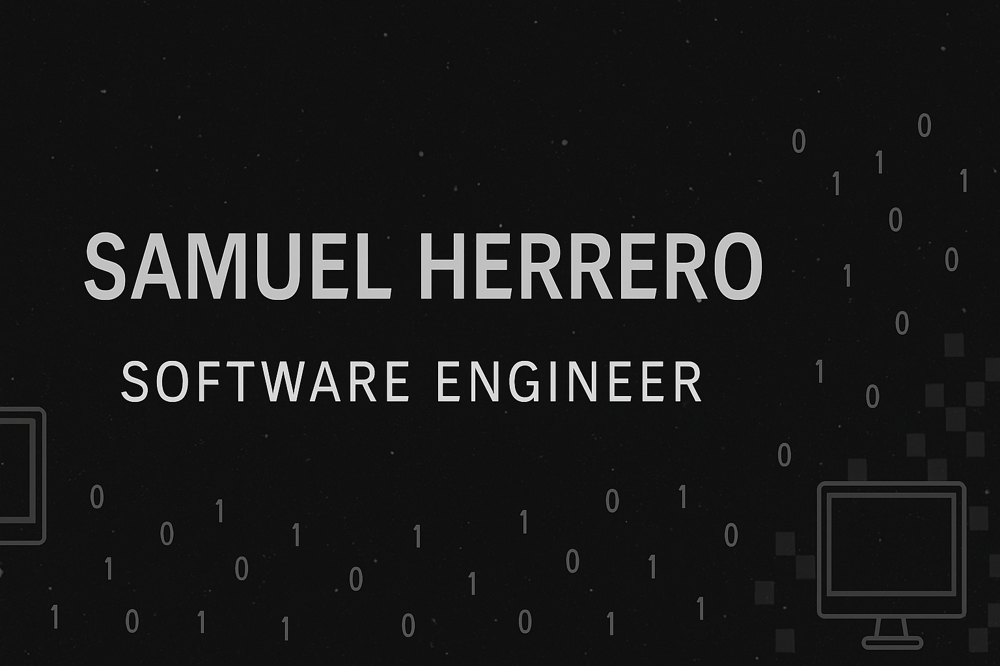

<!-- Banner -->

  

# Samuel Herrero
💻 I’m a Software Engineering student at Universidad Complutense de Madrid, just starting my journey in the tech world. I’m passionate about learning programming, version control, and exploring how technology can solve real problems and help people. I’m currently focusing on mastering Git, GitHub, and core development concepts, while also diving into areas like full‑stack development, cybersecurity, and artificial intelligence. My goal is to grow step by step, contribute to open‑source projects in the future, and build a strong foundation for my career as a software engineer. 🚀

### Skills:
- 💻​: CSS

- 🔭: I’m currently working on my own project 
- 🌱: I’m currently learning git and github 

### 🌐 Connect with me:

      

