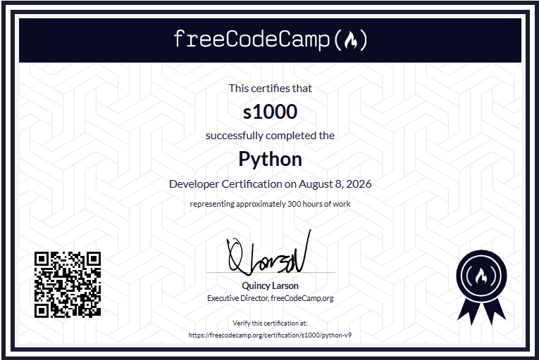

  

<h1 align="center">Hi there, I'm Samuel Herrero 👋</h1>
<h3 align="center">Software Engineering Student @ Universidad Complutense de Madrid</h3>

 

### 👨‍💻 About Me

I'm just starting my journey in the tech world. I'm passionate about exploring how technology can solve real problems and help people.

- 🔭 Currently working on **my personal portfolio and core development concepts**
- 🌱 Currently focusing on mastering **Python, Git, and GitHub**, while exploring full-stack development, cybersecurity, and AI
- 🎯 Goal: grow step by step, contribute to open-source projects, and build a strong foundation for a career in software engineering

### 🛠️ Tech Stack & Skills

 
   
   
   
   
   
   

### 🏆 Certifications

  

- **Python Developer Certification** — [freeCodeCamp](https://freecodecamp.org/certification/s1000/python-v9) *(August 2026 · ~300 hours of coursework)*

### 📊 GitHub Stats

  

### 🌐 Connect with Me

  
  
  

